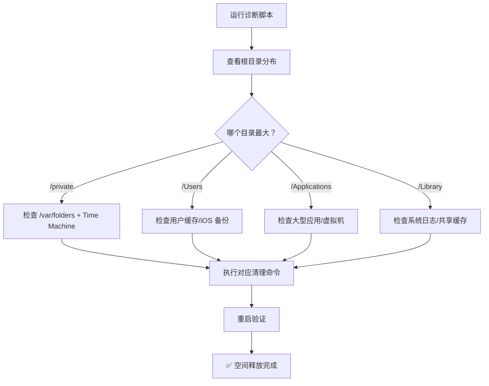

---

# 【A】查看根目录各大块占用（宏观定位）

```bash
sudo du -h -d 1 /System/Volumes/Data 2>/dev/null | sort -hr | head -10
```

**预期输出示例**：
```
416G  /System/Volumes/Data/private
134G  /System/Volumes/Data/Users
 25G  /System/Volumes/Data/Applications
 7.1G /System/Volumes/Data/Library
```

## 🔍 结果解读

| 占用最大的目录 | 可能原因 | 下一步操作 |
|--------------|---------|-----------|
| `/private` | Time Machine 快照 / 应用临时缓存 | → 【B】深入检查 |
| `/Users` | 用户缓存 / iOS 备份 / 下载文件 | → 【C】检查用户目录 |
| `/Applications` | 大型应用 / 虚拟机 / Docker | → 【D】检查应用数据 |
| `/Library` | 系统日志 / 共享缓存 | → 【E】检查系统缓存 |

---

# 【B】深入检查 /private（最常见元凶）

```bash
# 1. 查看 /private 下各子目录占用
sudo du -h -d 1 /System/Volumes/Data/private 2>/dev/null | sort -hr | head -10

# 2. 重点检查 /var/folders（临时文件集中地）
sudo du -h -d 2 /private/var/folders 2>/dev/null | grep -E '[0-9]+[GM]' | sort -hr | head -10

# 3. 查找超大临时文件（>1GB）
sudo find /private/var/folders -type f -size +1G 2>/dev/null | head -10
```

## 🎯 常见占用大户 & 解决方法

### 🔴 情况 1：Chrome/应用缓存 Bug（如 231GB zip_cache）
```bash
# 1. 退出对应应用
killall "Google Chrome" 2>/dev/null

# 2. 删除缓存目录（不影响 Cookie/账号）
sudo rm -rf /private/var/folders/*/T/com.google.Chrome/*
sudo rm -rf /private/var/folders/*/C/com.google.Chrome/*

# 3. 其他应用同理（替换应用标识符）
sudo rm -rf /private/var/folders/*/T/com.microsoft.VSCode/*
```

### 🔴 情况 2：Time Machine 本地快照
```bash
# 1. 查看快照列表
tmutil listlocalsnapshots /

# 2. 清理所有本地快照
for d in $(tmutil listlocalsnapshots / | grep -o '[0-9-]*'); do 
  sudo tmutil deletelocalsnapshots $d
done

# 3. （可选）禁用本地快照防止再次累积
sudo tmutil disablelocal 2>/dev/null
```

### 🔴 情况 3：通用临时文件堆积
```bash
# 安全清理所有用户的临时文件（T/目录）
sudo rm -rf /private/var/folders/*/*/T/*

# 清理缓存文件（C/目录，应用会重建）
sudo rm -rf /private/var/folders/*/*/C/*
```

---

# 【C】检查用户目录 /Users（个人数据）

```bash
# 1. 查看哪个用户占用最多
du -sh /System/Volumes/Data/Users/* 2>/dev/null | sort -hr

# 2. 深入检查当前用户（替换 jane 为你的用户名）
du -sh ~/Library/* 2>/dev/null | sort -hr | head -15

# 3. 重点检查这些目录
du -sh ~/Library/{Caches,Application\ Support/MobileSync/Backup,Containers} 2>/dev/null
```

## 🎯 常见占用大户 & 解决方法

### 🔴 情况 1：iOS/iPad 备份（20-100GB）
```bash
# 1. 查看备份列表
ls -lh ~/Library/Application\ Support/MobileSync/Backup/

# 2. 删除旧备份（保留最近 1-2 个）
rm -rf ~/Library/Application\ Support/MobileSync/Backup/[设备 ID]

# 3. 或在「访达」中连接设备 → 管理备份 → 删除
```

### 🔴 情况 2：应用缓存（Caches）
```bash
# 安全清理所有应用缓存
rm -rf ~/Library/Caches/*

# 或针对性清理（示例）
rm -rf ~/Library/Caches/Google/Chrome/*          # Chrome
rm -rf ~/Library/Caches/com.microsoft.VSCode/*   # VS Code
rm -rf ~/Library/Caches/pip/*                    # Python pip
```

### 🔴 情况 3：沙盒应用数据（Containers）
```bash
# 1. 查看 Containers 中占用最大的应用
du -sh ~/Library/Containers/* 2>/dev/null | sort -hr | head -10

# 2. 微信缓存清理（示例）
# 建议在微信 App 内：设置 → 通用 → 存储空间 → 清理
# 或手动删除（谨慎）：
rm -rf ~/Library/Containers/com.tencent.xinWeChat/Data/Library/Caches/*

# 3. Docker 缓存清理
docker system prune -a --volumes
```

### 🔴 情况 4：AI 模型/开发工具缓存
```bash
# Ollama 模型（~/.ollama/models）
ollama list                    # 查看已下载模型
ollama rm [模型名]            # 删除不需要的模型

# Conda 缓存
conda clean --all -y

# npm/yarn 缓存
npm cache clean --force
yarn cache clean
```

---

# 【D】检查 /Applications（大型应用）

```bash
# 1. 查看 Applications 下占用最大的应用
sudo du -sh /System/Volumes/Data/Applications/* 2>/dev/null | sort -hr | head -10

# 2. 检查虚拟机/容器镜像
ls -lh ~/Documents/*.utm ~/Documents/*.pvm ~/Library/Containers/com.docker.docker 2>/dev/null
```

## 🎯 常见占用大户 & 解决方法

### 🔴 情况 1：Docker 镜像/容器
```bash
# 查看 Docker 磁盘占用
docker system df

# 清理未使用的镜像/容器/卷/构建缓存
docker system prune -a --volumes

# 或删除特定镜像
docker rmi [镜像 ID]
```

### 🔴 情况 2：虚拟机文件（UTM/Parallels）
```bash
# 1. 查看虚拟机文件位置
find ~ -name "*.utm" -o -name "*.pvm" 2>/dev/null

# 2. 删除不需要的虚拟机（先在 App 内移除）
rm -rf ~/Documents/[虚拟机名].pvm

# 3. 或压缩/迁移到外置硬盘
```

### 🔴 情况 3：专业软件缓存（Final Cut / Adobe / Xcode）
```bash
# Final Cut Pro 渲染缓存
rm -rf ~/Library/Application\ Support/com.apple.finalcutpro/Render\ Files/*

# Adobe 媒体缓存
rm -rf ~/Library/Application\ Support/Adobe/Common/Media\ Cache\ Files/*

# Xcode 衍生数据
rm -rf ~/Library/Developer/Xcode/DerivedData/*
```

---

# 【E】检查 /Library（系统级缓存）

```bash
# 1. 查看系统 Library 占用
sudo du -sh /System/Volumes/Data/Library/* 2>/dev/null | sort -hr | head -10

# 2. 检查日志文件
sudo du -sh /private/var/log/* 2>/dev/null | sort -hr | head -10
```

## 🎯 常见占用大户 & 解决方法

### 🔴 情况 1：系统日志堆积
```bash
# 清理旧日志（系统会自动重建）
sudo rm -rf /var/log/*.{0,1,2,3,4,5,6,7}.gz
sudo rm -rf /private/var/log/asl/*.asl

# 重启后日志会重新生成，但体积会大幅减小
```

### 🔴 情况 2：软件更新残留
```bash
# 清理已安装的系统更新包
sudo rm -rf /Library/Updates/*
sudo rm -rf /System/Volumes/Data/private/var/db/SoftwareUpdate/*

# 清理 App Store 下载缓存
rm -rf ~/Library/Caches/com.apple.appstore/*
```

---

# 🧹 通用清理命令汇总（一键执行）

```bash
#!/bin/bash
echo "🧹 macOS 系统数据清理脚本"
echo "========================"

# 1. 退出可能占用缓存的应用
killall "Google Chrome" "Visual Studio Code" "Docker" 2>/dev/null

# 2. 清理 Time Machine 本地快照
echo "→ 清理 Time Machine 快照..."
for d in $(tmutil listlocalsnapshots / 2>/dev/null | grep -o '[0-9-]*'); do 
  sudo tmutil deletelocalsnapshots $d 2>/dev/null
done

# 3. 清理系统临时文件
echo "→ 清理系统临时文件..."
sudo rm -rf /private/var/folders/*/*/T/* 2>/dev/null
sudo rm -rf /private/var/folders/*/*/C/* 2>/dev/null

# 4. 清理用户缓存
echo "→ 清理用户缓存..."
rm -rf ~/Library/Caches/* 2>/dev/null

# 5. 清倒废纸篓
echo "→ 清倒废纸篓..."
sudo rm -rf ~/.Trash/* 2>/dev/null

# 6. 清理系统日志
echo "→ 清理系统日志..."
sudo rm -rf /var/log/*.{0,1,2,3,4,5,6,7}.gz 2>/dev/null

echo "✅ 清理完成！建议重启 Mac 以生效"
echo "🔄 执行: sudo shutdown -r now"
```

---

# ✅ 验证清理效果

```bash
# 1. 重启后检查 /var/folders 是否恢复正常
sudo du -h -d 1 /private/var/folders 2>/dev/null | sort -hr | head -5
# 预期: 从 200GB+ 降到 1-5GB

# 2. 查看整体存储空间变化
diskutil info / | grep "Free Space"
# 或: 苹果菜单 → 关于本机 → 存储空间

# 3. 确认应用正常运行
# 打开 Chrome/其他应用，确认登录状态、数据完整
```


# 🚨 安全红线（绝对不要删）

```bash
# ❌ 禁止删除以下内容:
/System/                          # 系统核心，删除会导致无法启动
/Library/Preferences/             # 系统配置，误删会丢失设置
/private/var/vm/swapfile*         # 虚拟内存，系统运行时正在使用
/private/var/db/                  # 系统数据库
~/Library/Containers/             # 沙盒应用数据（除非确认已卸载）

# ✅ 黄金原则:
# 1. 不确定的文件先搜索用途: "文件名 + macOS"
# 2. 先移到桌面观察 3 天，确认系统/应用正常再删除
# 3. 清理前务必备份重要数据
```
